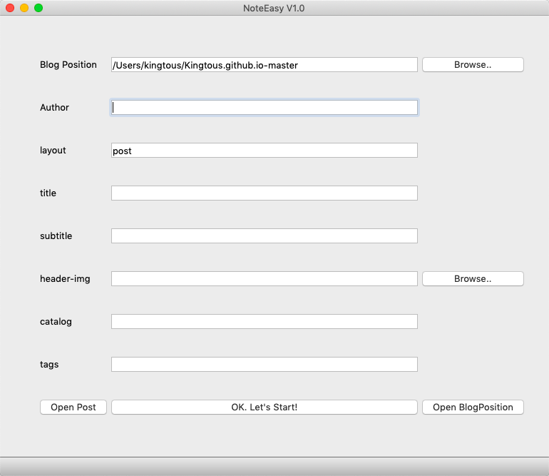

# NoteEasy-FrontMatter_Generator
Jekyll文档前缀信息填写器，自动生成文档模板，让您更专注于文档书写

- Got Mad in Command Line Or Editing Front Matter?
    - Let Create Front Matter Infomation for Jekyll in GUI Form!

## Character

- Record the last Blog Position inputed and reuse for the next one
- Automatic copy your head-img to the folder where img is ( default is "img/unsorted/" )
- Open the _posts folder after creating .md file

- Ignore info where the edit line is blank. 

## GUI Form

## Environment Passing

- macOS mojave 10.15.2
- Qt 5.14.0+
- Qt Creater 4.11.0
